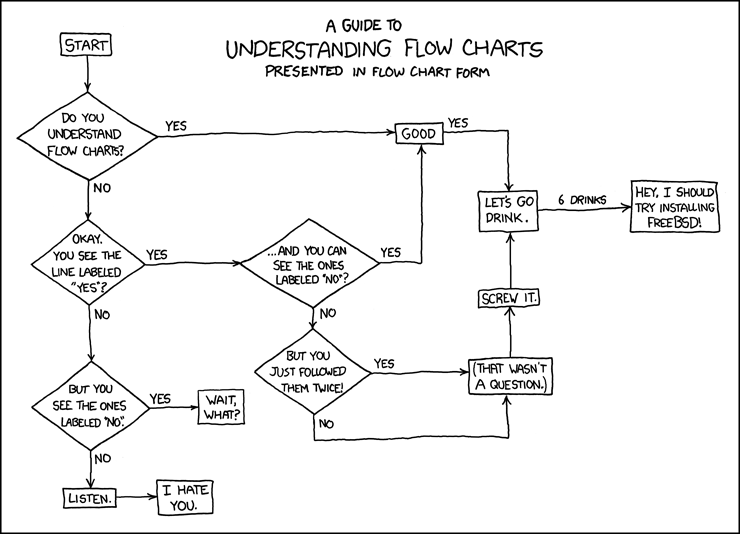
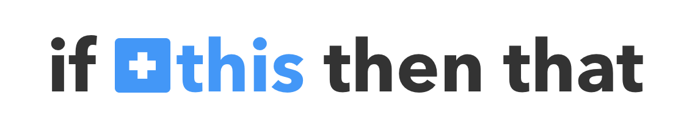
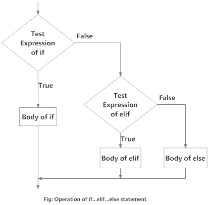
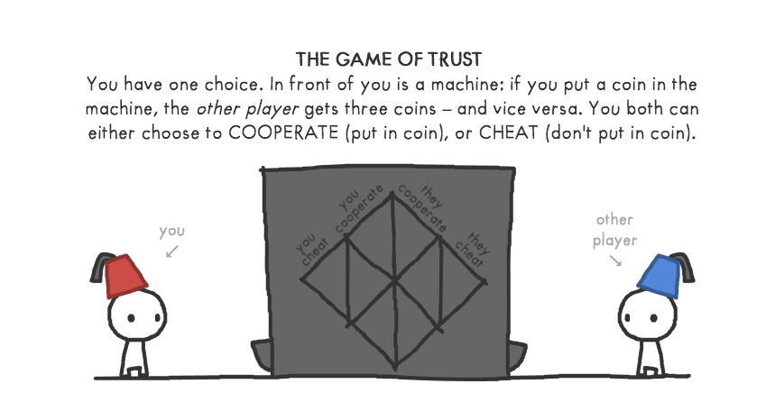

<br>
.center[]
.footnote[From [xkcd](https://xkcd.com/518/).]

---

.left-column-60[
## A typical Python program

```python
def function_1(...,...):
...
def function_2(...,...):
...
.
.
.
def function_k(...,...):
...

#Comments and so on.

statement_1
statement_2
.
.
.
statement_n
```
]
.right-column-40[

## How Python Sees This

<BR>

- The Python interpreter executes statements from top to bottom.

]

---


.left-column-60[
## A typical Python program

```python
def function_1(...,...):
...
def function_2(...,...):
...
.
.
.
def function_k(...,...):
...

#Comments and so on.

statement_1
statement_2
.
.
.
statement_n
```
]
.right-column-40[

## How Python Sees This

<BR>

- The Python interpreter executes statements from top to bottom.

- The function definitions and comments (lines starting with the # character) are parsed but not executed.


]

---


.left-column-60[
## A typical Python program

```python
def function_1(...,...):
...
def function_2(...,...):
...
.
.
.
def function_k(...,...):
...

#Comments and so on.

statement_1
statement_2
.
.
.
statement_n
```
]
.right-column-40[

## How Python Sees This

<BR>

- The Python interpreter executes statements from top to bottom.

- The function definitions and comments (lines starting with the # character) are parsed but not executed.

- Actual computation starts from .red[statement_1]
]


---

# Control Flow

- Need to vary computation sequence as values evolve.

--

- .red[Control flow] determines the order in which statements are executed.

--

  - Conditional Execution

--

     - Do something if something happens.
--

  - Repeated Execution or _Loops_

--
     - Do something again and again as long as something is true.

--
  - Function definitions

--
     - These blocks don't even execute until you call them.

      - Keeps your codebase organized 😎


---

name: inverse
class: center, middle, inverse

#Control Flow
## Conditionals
<br><br>
---
# If-Then-Else

<br><br>

.center[]

---

#If-Then-Else

<br><br>

From the website .red[[IFTTT](http://www.ifttt.com)]:

<p><span class="center"></span></p>


---

#If-Then-Else


<p><span class="center"></span></p>

---

#If-Then-Else


We use conditional executions all the time.

--
```python
if (sleepy == True):
  snooze_alarm()
else:
  wakeup()
```

--

- The statements .blue[snooze_alarm()] and .blue[wakeup()] are executed based on whether .red[sleepy] is .green[True] or .green[False].

--

- The if/else blocks are indented by spaces/tabs. It's important that you are consistent with your usage of spaces and tabs!

--

- The else block is not mandatory.

--

- You can handle multiple scenario cases by using if-elif-else statements.

--

```python
if (sleepiness == 10):
  snooze()
elif (sleepiness == 5):
  coffee()
else:
  wakeup()
```


---

#If-Then-Else

<br><br>
.center[]


.footnote[.pink[*]From .blue[[Programiz](https://www.programiz.com/python-programming/if-elif-else)].]

---

#If-Then-Else

<br><br>
.center[]


.footnote[.pink[*]From .blue[[Programiz](https://www.programiz.com/python-programming/if-elif-else)].]

---
#If-Then-Else

.center[]


.footnote[.pink[*]From .blue[[Programiz](https://www.programiz.com/python-programming/if-elif-else)].]

---
#If-Then-Else

<p><span class="center"></span></p>


.footnote[.pink[*]From .blue[[Trust by Nicky Case.](http://ncase.me/trust)].]
---

name: inverse
class: center, middle, inverse

#Control Flow
## Repetition
<br><br>
---

# Loops

<p><span class="center"></span></p>
.footnote[This is [xkcd](https://xkcd.com/1411/) again.]
---

# Loops - Fixed Iterations

## .blue[Repeating something n times]

--

- Use the .blue[for] statement in such scenarios.

--

```python
n = 10
for i in range(n):
  print(i, end=" ")
print() # Prints a newline
```

--

```python
0 1 2 3 4 5 6 7 8 9
```
--

- The code below will print numbers from 5 (.green[inclusive]) to 10 (.red[exclusive]).

--

```python
x = 5
y = 10
for i in range(x,y):
  print(i, end=" ")
print() #Prints a newline
```
--

```python
5 6 7 8 9
```

---

# Loops - Example

--

## .blue[Factors of a number n]

--

List all the factors of a number n.

--

```python
n = 50
for i in range(1,n+1):
  if n%i == 0:
    print(i)
```

--

Cutting down the number of iterations:

--

```python
n = 50
from math import sqrt
for i in range(1,int(sqrt(n))+1):
  if n%i == 0:
    print(i)
    print(int(n/i))
```

---

# Loops - Iterations based on Conditions

--

Often we don't know the number of repetitions in advance.

--

```python
sleepy = 10
while(sleepy):
  snooze()
  sleepy = sleepy - 1
```

--

Executes the body if condition evaluates to .red[True].

--

After each iteration, check if condition is True again.

--

☠️ Note that this execution <mark>will not terminate</mark> if the condition never evaluates to .red[False]!


---

#While Control Flow

.center[]

.footnote[.pink[*]From .blue[[Programiz](https://www.programiz.com/python-programming/while-loop)].]

---

name: inverse
layout: true
class: center, middle, inverse

---

#🎉