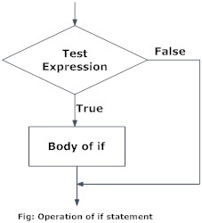

<br>
.center[]

---

.left-column-60[
## A typical Python program

```python
def function_1(...,...):
...
def function_2(...,...):
...
.
.
.
def function_k(...,...):
...

#Comments and so on.

statement_1
statement_2
.
.
.
statement_n
```
]
.right-column-40[

## How Python Sees This

<BR>

- The Python interpreter executes statements from top to bottom.

]

---


.left-column-60[
## A typical Python program

```python
def function_1(...,...):
...
def function_2(...,...):
...
.
.
.
def function_k(...,...):
...

#Comments and so on.

statement_1
statement_2
.
.
.
statement_n
```
]
.right-column-40[

## How Python Sees This

<BR>

- The Python interpreter executes statements from top to bottom.

- The function definitions and comments (lines starting with the # character) are parsed but not executed.


]

---


.left-column-60[
## A typical Python program

```python
def function_1(...,...):
...
def function_2(...,...):
...
.
.
.
def function_k(...,...):
...

#Comments and so on.

statement_1
statement_2
.
.
.
statement_n
```
]
.right-column-40[

## How Python Sees This

<BR>

- The Python interpreter executes statements from top to bottom.

- The function definitions and comments (lines starting with the # character) are parsed but not executed.

- Actual computation starts from .red[statement_1]
]


---

# Control Flow

- Need to vary computation sequence as values evolve.

--

- .red[Control flow] determines the order in which statements are executed.

--

  - Conditional Execution

--

     - Do something if something happens.
--

  - Repeated Execution or _Loops_

--
     - Do something again and again as long as something is true.

--
  - Function definitions

--
     - These blocks don't even execute until you call them.

      - Keeps your codebase organized 😎


---

name: inverse
class: center, middle, inverse

#Control Flow
## Conditionals
<br><br>
---
# If-Then-Else

<br><br>

.center[]

---

#If-Then-Else

<br><br>

From the website .red[[IFTTT](http://www.ifttt.com)]:

<p><span class="center"></span></p>


---

#If-Then-Else


<p><span class="center"></span></p>

---

#If-Then-Else


We use conditional executions all the time.

--
```python
if (sleepy == True):
  snooze_alarm()
else:
  wakeup()
```

--

- The statements .blue[snooze_alarm()] and .blue[wakeup()] are executed based on whether .red[sleepy] is .green[True] or .green[False].

--

- The if/else blocks are indented by spaces/tabs. It's important that you are consistent with your usage of spaces and tabs!

--

- The else block is not mandatory.

--

- You can handle multiple scenario cases by using if-elif-else statements.

--

```python
if (sleepiness == 10):
  snooze()
elif (sleepiness == 5):
  coffee()
else:
  wakeup()
```


---

#If-Then-Else

<br><br>
.center[]


.footnote[.pink[*]From .blue[[Programiz](https://www.programiz.com/python-programming/if-elif-else)].]

---

#If-Then-Else

<br><br>
.center[]


.footnote[.pink[*]From .blue[[Programiz](https://www.programiz.com/python-programming/if-elif-else)].]

---
#If-Then-Else

.center[]


.footnote[.pink[*]From .blue[[Programiz](https://www.programiz.com/python-programming/if-elif-else)].]

---
#If-Then-Else

<p><span class="center"></span></p>


.footnote[.pink[*]From .blue[[Trust by Nicky Case.](http://ncase.me/trust)].]
---

name: inverse
class: center, middle, inverse

#Control Flow
## Repetition
<br><br>
---

# Loops

<p><span class="center"></span></p>
---

# Loops - Fixed Iterations

## .blue[Repeating something n times]

--

- Use the .blue[for] statement in such scenarios.

--

```python
n = 10
for i in range(n):
  print(i, end=" ")
print() # Prints a newline
```

--

```python
0 1 2 3 4 5 6 7 8 9
```
--

- The code below will print numbers from 5 (.green[inclusive]) to 10 (.red[exclusive]).

--

```python
x = 5
y = 10
for i in range(x,y):
  print(i, end=" ")
print() #Prints a newline
```
--

```python
5 6 7 8 9
```

---

# Loops - Example

--

## .blue[Factors of a number n]

--

List all the factors of a number n.

--

```python
n = 50
for i in range(1,n+1):
  if n%i == 0:
    print(i)
```

--

Cutting down the number of iterations:

--

```python
n = 50
from math import sqrt
for i in range(1,int(sqrt(n))+1):
  if n%i == 0:
    print(i)
    print(int(n/i))
```

---

# Loops - Iterations based on Conditions

--

Often we don't know the number of repetitions in advance.

--

```python
sleepy = 10
while(sleepy):
  snooze()
  sleepy = sleepy - 1
```

--

Executes the body if condition evaluates to .red[True].

--

After each iteration, check if condition is True again.

--

☠️ Note that this execution <mark>will not terminate</mark> if the condition never evaluates to .red[False]!


---

#While Control Flow

.center[]

.footnote[.pink[*]From .blue[[Programiz](https://www.programiz.com/python-programming/while-loop)].]
---

name: inverse
class: center, middle, inverse

#Control Flow
## Functions
<br><br>

---


# Functions

--

- A function is a group of statements that performs a given task.

--

- We can write the function code as a part of the main program, but by isolating it we can logically separate out units of work.

--

- Typically functions are called repeatedly with different arguments.

--

- We define functions with the .blue[def] statement.

--

```python
def f(a,b,c):
  statement_1
  statement_2
  statement_3
  .
  .
  .
  return(v)
  .
  .
  .
```

--

- The body of the function is indented.

--

- .red[return()]  statement exits and returns a value.

---

# Functions: passing values.

Argument value is substituted for name.

```python
def power(x,n):
  ans = 1
  for i in range(0,n):
    ans = ans*x
  return(ans)

```

--

Invoking the function in code:

```python
power(3,5)
```

--

This is the same as:

```python
x = 3
n = 5
ans = 1
for i in range(0,n):
  ans = ans*x
return(ans)
```
---

# Functions: passing arguments by name

For a function like this:

```python
def power(x,n):
  ans = 1
  for i in range(0,n):
    ans = ans*x
  return(ans)

```

You can call it like this:

```python
power(n=5,x=4)
```

---

# Functions: default values for arguments

Recall that .green[int(s)] converts a string to an integer.

--

In particular:

.blue[int("76")] is 76

but:

.red[int("A5")] generates an error

--

It turns out that this converter takes two arguments: .green[a string s] and .green[a base b].

--

.blue[int("A5",16)] returns 165. If not specified, .highlight[b defaults to 10.]

---

# Functions: default values for arguments

```python
def int(s,b=10)
  ...
```

--

The default value is provided in the function definition.

--

If the parameter is omitted, the default value is used.

--

The default value must be available at the time of definition. It cannot be result of a computation of some other parameter that is being passed.

--

For example, if A is a list, something like:

```python
def my_function(A,start=0,end=len(A))
  ...
```

...does not work!

---

# Functions: default values for arguments

```python
def f(a,b,c=14,d=22)
  ...
```

--

.red[f(13,12)] is interpreted as .blue[f(13,12,14,22)].

--

.red[f(13,12,16)] is interpreted as .blue[f(13,12,16,22)].

--

.highlight[The order of the arguments is important.]

--

If you want to use the default for c but define d, then that is not possible with this ordering.

--

The default values always come at the end.

--

Even in the function definition, the following would give you an error:

--

```python
def f(a=10,b=10,c,d)
  ...
```
---

# Conditional Function Definitions

.red[def] associates a function body with a name.

--

This makes function definitions flexible, like any other assignmentin Python.

--

For example, definitions can be conditional:

```python
if <condition>:
  def f(x,y,z):
    ...
else:
  def f(x,y,z):
    ...
```

--

Can sometimes be confusing.

--

💀 Don't try this at home, but be aware of this when reading code.

---

# Can rename and pass functions around

```python
def f(x):
  ...

g = x
```

Now g is another name for f.

--

Appy f to x n times:

```python
def apply(f,x,n):
  res = x
  for i in range(n):
    res = f(res)
  return(res)
```

--

```python
def square(x):
  return x*x
```

When you call .red[apply(square,5,2)], the function .blue[square] is being assigned to .blue[f].

---

# Typical application of passing functions

May want to write a customizable sorting function.

--

Define a sorting method that takes its own method to compare two elements:

--

```python
def sortfunction(L,cmpfn=defaultcmpfn)
```

---

name: inverse
class: center, middle, inverse

#Recursion
##When functions call themselves
<BR><BR>
---

#Recursive functions

A function can call itself.

--

```python
def factorial(n):
  if n <= 0:
    return(1)
  else:
    val = n * factorial(n-1)
    return(val)
```

---

name: inverse
layout: true
class: center, middle, inverse

---

#🎉